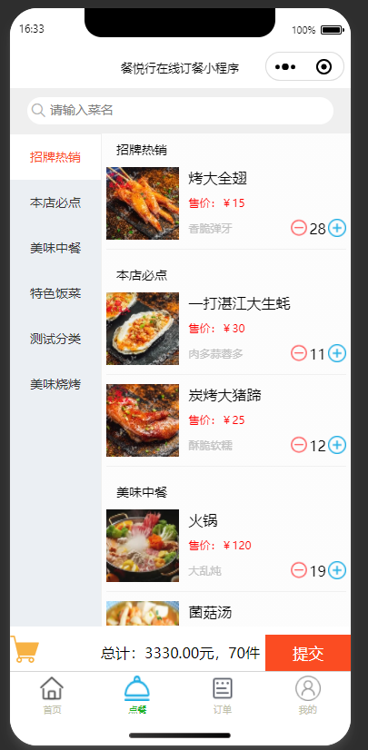
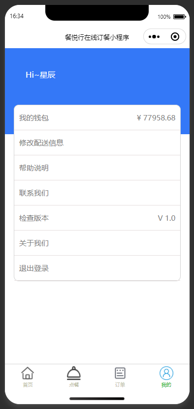
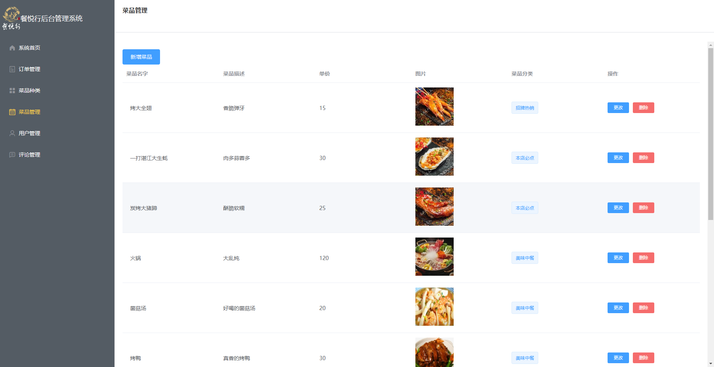
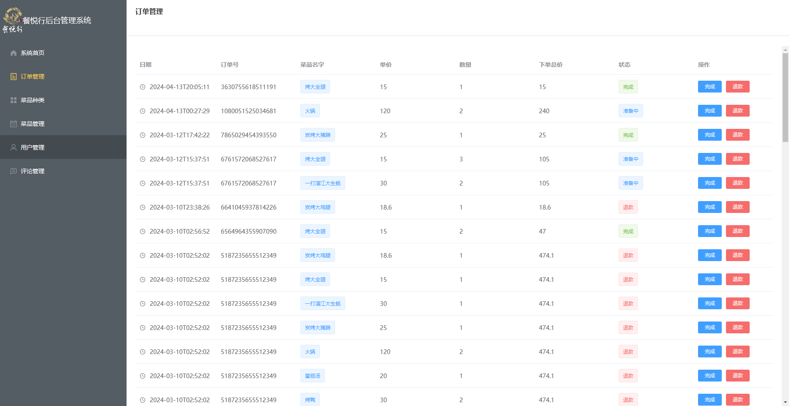

# 餐悦行在线点餐程序

## 介绍

餐悦行在线点餐程序是一个结合了 Spring Boot 后端、Vue 前端和微信小程序的在线点餐系统。该项目旨在为用户提供便捷的在线点餐体验，同时为餐厅提供高效的订单管理系统。

## 功能

- 用户注册和登录
- 浏览菜单和搜索菜品
- 添加菜品到购物车
- 在线支付
- 查看订单历史
- 餐厅后台管理系统

## 技术栈

- 后端：Spring Boot
- 前端：Vue
- 小程序：微信小程序

## 成品预览
- 小程序端
 

- 后台管理端
 
## 快速开始

### 环境要求

- JDK 8+
- Node.js 14+
- Maven 3+
- 微信开发者工具

### 后端启动

1. 克隆项目代码：

    ```bash
    git clone https://github.com/33448821/canyuexing.git
    ```

2. 进入后端目录并打包：

    ```bash
    cd OrderFood
    mvn clean install
    ```

3. 启动 Spring Boot 应用：

    ```bash
    mvn spring-boot:run
    ```

### 前端启动

1. 进入前端目录并安装依赖：

    ```bash
    cd order_food_vue
    npm install
    ```

2. 启动 Vue 应用：

    ```bash
    npm run serve
    ```

### 小程序启动

1. 使用微信开发者工具导入 `xcx` 目录。

2. 配置小程序的后台接口地址为后端服务的地址。

### 特别说明:部署到服务器时需要修改的IP地址

### 1.小程序部分

- pages\canteen\canteen.js

- pages\order\order.js

- utils\http.js


### 2.Vue前端

- order_food_vue/src/utils/request.js

## 贡献

欢迎贡献代码！请 fork 本仓库并提交 pull request。如有问题您也打开一个issue讨论您想要更改的内容。

## 许可证

本项目采用 MIT 许可证。详情请参阅 [LICENSE](LICENSE) 文件。

---

# CanYueXing Online Ordering System

## Introduction

The CanYueXing Online Ordering System is an integrated platform combining a Spring Boot backend, Vue frontend, and WeChat Mini Program. This project aims to provide users with a convenient online ordering experience while offering an efficient order management system for restaurants.

## Features

- User registration and login
- Browse menu and search for dishes
- Add dishes to the shopping cart
- Online payment
- View order history
- Restaurant backend management system

## Tech Stack

- Backend: Spring Boot
- Frontend: Vue
- Mini Program: WeChat Mini Program

## Quick Start

### Prerequisites

- JDK 8+
- Node.js 14+
- Maven 3+
- WeChat Developer Tools

### Backend Setup

1. Clone the project repository:

    ```bash
    git clone https://github.com/33448821/canyuexing.git
    ```

2. Navigate to the backend directory and package the application:

    ```bash
    cd OrderFood
    mvn clean install
    ```

3. Start the Spring Boot application:

    ```bash
    mvn spring-boot:run
    ```

### Frontend Setup

1. Navigate to the frontend directory and install dependencies:

    ```bash
    cd order_food_vue
    npm install
    ```

2. Start the Vue application:

    ```bash
    npm run serve
    ```

### Mini Program Setup

1. Import the `xcx` directory using the WeChat Developer Tools.

2. Configure the Mini Program's backend API address to match the backend service address.

### Special Note: Modifying IP Addresses for Server Deployment

#### 1. Mini Program

- `pages/canteen/canteen.js`
- `pages/order/order.js`
- `utils/http.js`

#### 2. Vue Frontend

- `order_food_vue/src/utils/request.js`

## Contribution

Contributions are welcome! Please fork the repository and submit a pull request. For major changes, please open an issue first to discuss what you would like to change.

## License

This project is licensed under the MIT License. For details, please refer to the [LICENSE](LICENSE) file.
